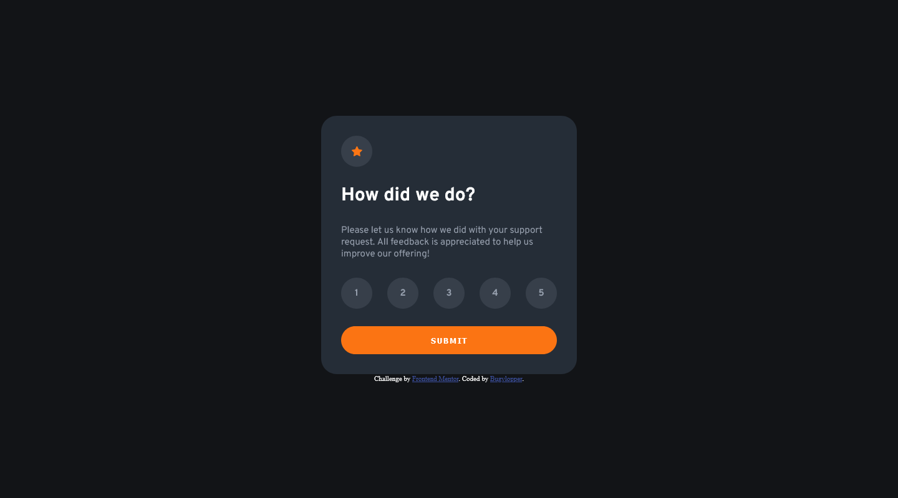
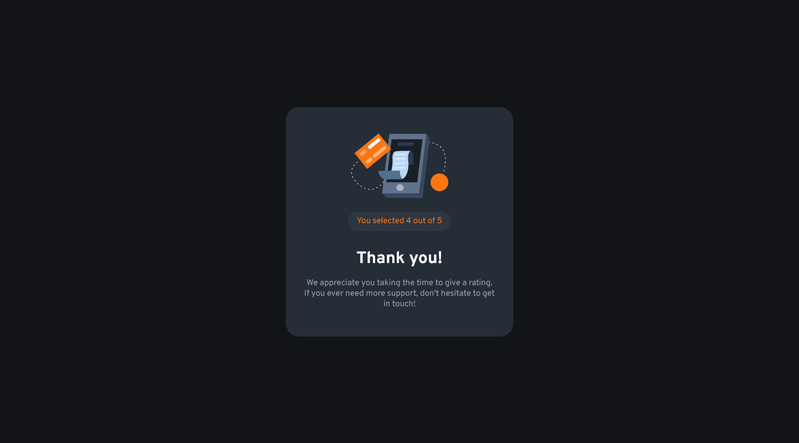

# Frontend Mentor - Interactive rating component solution

This is a solution to the [Interactive rating component challenge on Frontend Mentor](https://www.frontendmentor.io/challenges/interactive-rating-component-koxpeBUmI). Frontend Mentor challenges help you improve your coding skills by building realistic projects. 

## Table of contents

- [Overview](#overview)
  - [The challenge](#the-challenge)
  - [Screenshot](#screenshot)
  - [Links](#links)
- [My process](#my-process)
  - [Built with](#built-with)
  - [What I learned](#what-i-learned)
  - [Continued development](#continued-development)
  - [Useful resources](#useful-resources)
- [Author](#author)
- [Acknowledgments](#acknowledgments)

**Note: Delete this note and update the table of contents based on what sections you keep.**

## Overview

### The challenge

Users should be able to:

- View the optimal layout for the app depending on their device's screen size
- See hover states for all interactive elements on the page
- Select and submit a number rating
- See the "Thank you" card state after submitting a rating

### Screenshot




### Links

- Solution URL: [https://github.com/bugvlopper/frontendMentor-interactive-rating-component.git](https://github.com/bugvlopper/frontendMentor-interactive-rating-component.git)
- Live Site URL: [https://bugvlopper.github.io/frontendMentor-interactive-rating-component](https://bugvlopper.github.io/frontendMentor-interactive-rating-component)

## My process

### Built with

- JSX
- CSS custom properties
- Flexbox
- Mobile workflow
- [React](https://reactjs.org/) - JS library

### What I learned


```js
/* you can found this line in App.js */
<button onClick={this._submit}>submit</button>

 _submit(){
      this.props.root.render(<Thanks rate={this.state.rate}/>)
  }
```

I learned how to rerender the app but i think it's a bad way to do it . Cant go back no url modification. If someone can't tell me how to do it without library (if it's possible) or redirect me to a good ressource, it will help me a lot !


### Continued development

Big probleme to understand how to make a multiple page app, found nothing in react official doc (i don't read all the documentation yet), discover react-router-dom but don't success to make it work(not sure if it's the best or only way).

### Useful resources

- [React : Chapitre 4, Notre premier composant](https://www.youtube.com/watch?v=dSarn49JYQo&list=PLjwdMgw5TTLWom67YfZuha-1iYzIirwJR&index=4) - This video give me the idea to switch from rating card(App.js) to thanks card(Thanks.js)


## Author

- Frontend Mentor - [@bugvlopper](https://www.frontendmentor.io/profile/bugvlopper)


## Acknowledgments

Thanks to [Grafikart](https://www.youtube.com/c/grafikart) for his tutorial on react.
